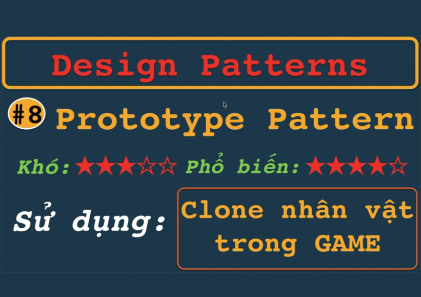
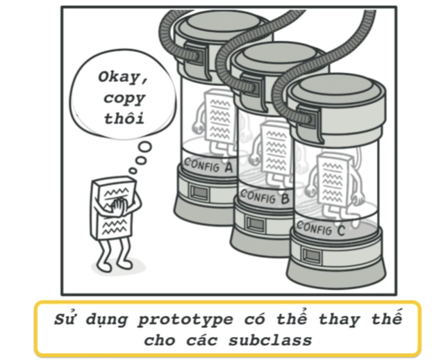
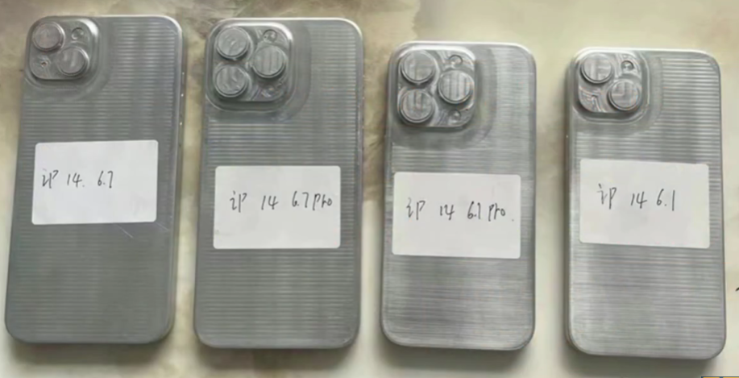
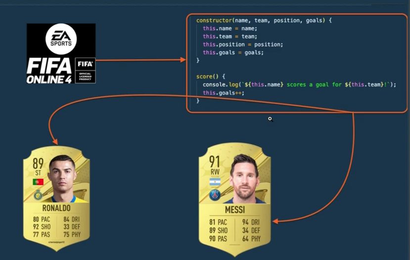

# Prototype pattern
## ? Mục đích sử dụng của Prototye là gì
## ? Khi nào sử dụng
## ? Triển khai như nào





# ========
## ?=> Mục đích sử dụng của Prototye là gì
```
Sử dụng tính nguyên mẫu để tạo nhiều phiên bản (Component, ...) 
với các thuộc tính hành vi chức năng chung 
=> sau đó có thể sao chép ra 1 phiên bản mới nếu cần
```

## ?=> Khi nào sử dụng
EX: Clone ra nhân vật Ronaldo & Messi từ 1 object => có thể thay đổi thuộc tính từ base của Object linh hoạt


### Nhưọc điểm:
```
Những thuộc tính chứa trong tham chiếu (Object) sẽ được chia sẻ tất cả instance 
=> Object chính sửa đổi sẽ ảnh hưởng tới toàn bộ Clone()
```
